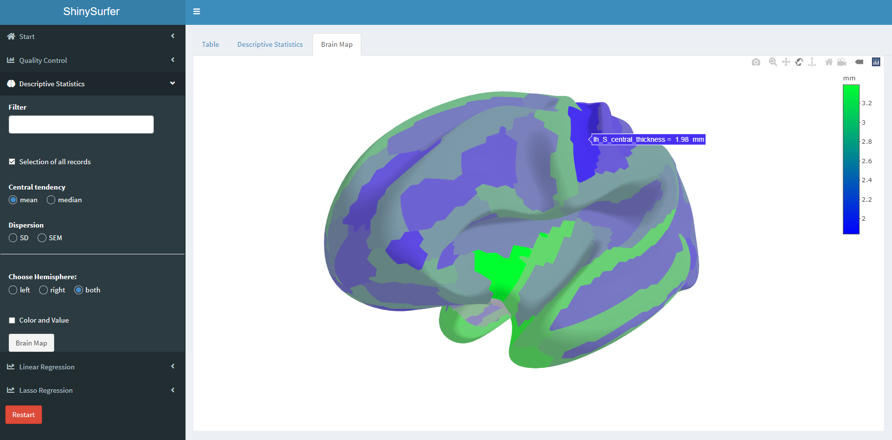

# __ShinySurfer__: Software tool for the Analysis and Visualization of MRI images of the brain



For more information use the [Homepage](https://sandrakla.github.io/ShinySurfer_Homepage/).

## Installation 

Download the Zip-File from this Shiny App and set your working direction to this path and run:

```bash
# Test if shiny is installed:
if("shiny" %in% rownames(installed.packages())){
  library(shiny)} else{
  install.packages("shiny")}
```

```bash
library(shiny)
runApp("app.R")
```
Or use the function ```runGitHub()``` from the package *shiny*:

```bash
library(shiny)
runGitHub("ShinySurfer", "SandraKla")
```

All required packages must be downloaded before starting this app. For more information about the required packages use the [Homepage](https://sandrakla.github.io/ShinySurfer_Homepage/about.html).

### Citation:

- Klawitter S, Cai Y, Ye B, Klawonn F, Sörös P. ShinySurfer: A tool for visualization and statistical analysis of cortical parameters [version 1; not peer reviewed]. F1000Research 2021, 10:440 (poster) (doi: 10.7490/f1000research.1118565.1)
- [OHBM 2021](https://ww4.aievolution.com/hbm2101/index.cfm?do=abs.viewAbs&src=ext&abs=1685)
